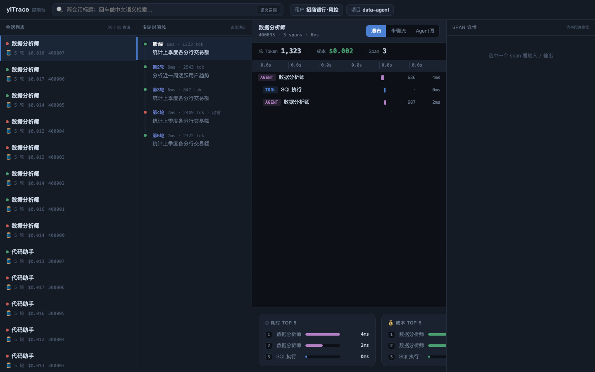

# yiTrace

> A single-node, single-directory, **zero-external-dependency AI agent observability database engine**. Built from scratch in Rust. Ingest the traces your agents produce (multi-turn dialogue, tool calls, multi-agent collaboration) and get trace reconstruction, Chinese BM25 search, filtered vector recall, cost attribution, and an eval loop.

**中文文档** · [English (this file)](README.md)

[](LICENSE)
[](https://www.rust-lang.org/)
[](yitrace-engine)
[](#current-status)
[](#features)

**LLM Observability · Trace Store · Chinese Search · Vector ANN · Cost Attribution · Eval Loop · OTLP-compatible**

Point your OTLP/OpenInference-instrumented app — or your own agent — at it. One command starts the server; the engine core uses only the Rust standard library and compiles offline.



> **Status:** a compiling, runnable, fully-tested **validation skeleton** (engine 122 unit + 6 integration tests · columnar segment 7 · Python/TS SDK 8 each). Core data paths, Chinese search, filtered vector recall, the SIMD distance kernel, and the eval loop are all verified by code; production-grade pieces (real jieba FFI / DataFusion query exec / lock-free manifest) are swappable trait seams — see [Current Status](#current-status).

---

## Features

- **Self-built storage engine**: append-only events + read-time folding (merge-on-read), immutable segments, copy-on-write manifest, snapshot isolation.
- **Deterministic `event_id`**: id = content hash, byte-identical across Python / TypeScript / engine. Retransmits and crash replays count once; tokens/cost never double-counted.
- **Chinese search**: self-built inverted index + BM25, CJK-tokenized for unsegmented text — recall ranks by relevance across non-contiguous multi-concept queries.
- **Filtered semantic recall**: vector ANN pushes the filter down into graph traversal (in-graph filtering); recall holds under sparse filters.
- **Hybrid retrieval**: keyword + semantic fused via RRF.
- **Columnar segment store**: optional [Vortex](https://github.com/spiraldb/vortex) backend with predicate pushdown + projection pushdown (cost/aggregation queries skip large-text columns).
- **Crash-safe**: WAL (fsync), segment files, manifest, and vector index all persist — restart after a crash rebuilds data and indexes automatically.
- **Ecosystem entry**: native OTLP / OpenInference ingestion (OTel GenAI `gen_ai.*`, Arize `llm.*`) — already-instrumented apps ingest without a line changed.
- **Zero-dependency skeleton**: the engine body uses only the Rust standard library; `cargo test --offline` passes. Heavy deps (Vortex, etc.) are isolated in separate crates.

---

## Quick Start

Requires Rust 1.80+.

```bash
cd yitrace-engine

# Run all tests (incl. concurrency stress + socket HTTP round-trip +
# filtered-ANN recall + restart-keeps-data)
cargo test --offline

# Run the demo: ingest fake traces → fold into full traces →
# search "盗刷" (fraud) → vector similarity → hybrid recall
cargo run -p yt-engine --example demo --offline

# Start the HTTP ingest/query server (8-thread pool, with seed eval data)
cargo run -p yt-engine --example server
```

Once the server is up (`http://127.0.0.1:7878`):

```bash
# Ingest (SDK wire-format JSON batch)
curl -XPOST localhost:7878/v1/ingest \
  -d '[{"trace_id":7,"span_id":1,"ts":1,"seq":1,"event_type":1,"ext_span_id":"7-1","status":0,"input_tokens":900,"logs":["start"]}]'

# Trace list
curl localhost:7878/v1/traces

# Chinese search + filter by agent / status
curl -XPOST localhost:7878/v1/search \
  -d '{"text":"盗刷","k":10,"filter":{"agent_name":"风控","status":1}}'

# Pure-vector similarity / keyword+semantic hybrid (RRF)
curl -XPOST localhost:7878/v1/search -d '{"vector":[0.1,0.2],"k":10}'
curl -XPOST localhost:7878/v1/search -d '{"text":"盗刷","vector":[0.1,0.2],"k":10}'
```

Optional: `YT_TOKEN=secret cargo run ... --example server` enables Bearer-token auth; `cargo test -p yt-engine --features gzip` adds request-body gzip support.

> **Want to build your own UI / dashboard on top of yiTrace?** The bundled console has no privileges — it talks to the same `/v1/*` JSON API as any third-party frontend. See the **[HTTP API Reference](docs/API_REFERENCE.md)** for every endpoint, request/response schema, and curl examples.

The columnar segment store (Vortex) lives in its own crate with heavier deps:

```bash
cd yitrace-segstore-vortex && cargo build
```

---

## Architecture

```
SDK(Py/TS) ─┐
OTLP/HTTP  ─┼─► ingest gateway ─► WAL(fsync) ─► memtable ──flush──► immutable segment(row / Vortex columnar)
            │                              │                  │
            │              deterministic event_id dedup    tiered compaction
            ▼                              ▼
   search index(CJK BM25 / graph-vector ANN / attr sidecar)   4-source read-time fold(mem + seg + delete + late-write)
            │                              │
            └──────────────► search / list / tree / eval / cost ◄──────┘
                       snapshot isolation + watermark-safe reclamation
```

Three core mechanisms:

- **Events, not spans**: a span is split into `SpanStart` / `SpanEnd` / attribute-write immutable events; the reader folds them by identity into one complete span. Writes are always append-only — no in-place updates.
- **Deterministic `event_id`** = `hash(ext_span_id, seq, event_type)`: the dedup key is content-derived, so retransmit/replay is naturally idempotent.
- **4-source read fold**: across one snapshot, merge-dedupe "memtable + segments + delete bitmap + late write-back"; the dedup key is `event_id`.

Full internal design: [`docs/design/2026-06-22_yitrace-技术文档.md`](docs/design/2026-06-22_yitrace-技术文档.md).

---

## Repository Layout

```
yitrace-engine/          # engine (Rust workspace, std-only, zero-dep)
│   └── crates/
│       ├── yt-core         # core types: ids, deterministic event_id, immutable Manifest, fold
│       ├── yt-manifest     # single-writer/multi-reader: snapshot pin, reclamation watermark
│       ├── yt-wal          # write-ahead log: fsync, crash-safe frames, zero-dep binary encoding
│       ├── yt-memtable     # live memtable: dual low/high watermark + gated evict
│       └── yt-engine       # coordinator, 4-source fold, search, eval, HTTP/OTLP
yitrace-segstore-vortex/ # columnar segment store (Vortex), implements SegmentStore
yitrace-sdk/             # instrumentation SDK
    ├── python/             # Python: nested spans, token counting, deterministic event_id
    └── typescript/         # TypeScript: same semantics, BigInt for large-int precision
```

---

## SDK

**Python**

```python
from yitrace import Tracer, ConsoleExporter

tracer = Tracer(exporter=ConsoleExporter(), node_id=1)

with tracer.trace("AML screening") as t:
    with t.span("txn risk control") as root:
        with root.span("LLM judgment") as child:   # nesting auto-builds parent/child
            child.log("needs human review")
            child.set_status(0)
```

Nested `span` calls auto-build parent/child edges; the trace reconstructs as a tree in the engine. Each span emits `SPAN_START` + `LOG`s + `SPAN_END`, folded by `(trace, span)` into one complete span on ingest. Python and TypeScript SDKs compute **byte-identical** `event_id` for the same identity (cross-checked in tests). See [Python](yitrace-sdk/python/README.md) · [TypeScript](yitrace-sdk/typescript/README.md).

---

## Current Status

**Verified by tests (real failing invariants, not window dressing):**

- Storage correctness: deterministic `event_id` dedup, 4-source fold, snapshot isolation, crash-replay idempotency (incl. a real `kill -9` test), compaction re-read merge, restart-keeps-data.
- Search: Chinese BM25 multi-concept recall beats naive substring; in-graph ANN recall ≫ post-filter (table-driven, multi-selectivity).
- Vector index: on-disk multi-layer HNSW (persists, no rebuild on restart) + **SIMD distance kernel** (std::arch runtime dispatch — x86_64 AVX-512/AVX2/SSE2, aarch64 NEON, ~5.5× on 768-dim) + neighbor-selection heuristic (recall@10 = 1.00) + multi-metric (L2/Cosine/IP).
- End-to-end: SDK / OTLP → HTTP → fold → search / eval / cost, all exercised.
- Columnar segment: Vortex write + predicate pushdown + projection pushdown wired into the read path.

**Still validation-grade or pending:**

- **Chinese tokenization is production-grade**: self-built pure-Rust `ChineseTokenizer` (dictionary DAG + max-probability DP, 349k-word jieba dict embedded, pluggable user dict). The team's real jieba lib plugs in via an FFI crate (`--features link`, engine logic untouched).
- Eval uses a rule scorer; LLM-judge pending. Vector quantization (PQ/SQ) and concurrent multi-threaded build are future upgrades.
- Manifest uses a `RwLock<Arc<>>` skeleton; production swaps in arc-swap + crossbeam-epoch. Query execution via DataFusion is pending.

The trait seams (`SegmentStore` / `Tokenizer` / `Bm25Index` / `GraphIndex`) are in place — swapping implementations doesn't touch the upper layers.

---

## Build Requirements

- Rust 1.80+ (engine, edition 2021, zero external deps)
- Rust 1.91+ (`yitrace-segstore-vortex`, deps Vortex 0.75 + Arrow 58 + Tokio)
- Python 3.8+ / Node 18+ (SDK)

## License

MIT
