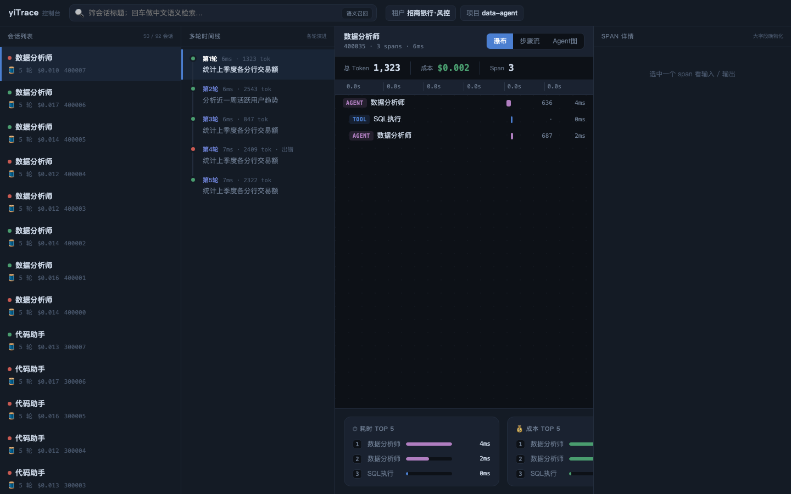

# yiTrace

**给 AI Agent 用的本地优先 TraceDB。**

yiTrace 把 Agent 的原始事件变成可查询证据。你可以回放多轮运行、查看工具调用、
搜索中文/英文 trace、分析 token/成本/eval，并把路径证据导出给 Agent Memory。
它可以通过 `@yitrace/db` 嵌进 Node / Electron，也可以通过 `yitrace-db` 嵌进 Python
或 Rust，还可以跑成私有服务，后续再放到分片 gateway 后面。

中文 · [English](README.md)

[](LICENSE)
[](https://www.rust-lang.org/)
[](#项目状态)
[](#工作原理)
[](#摄入-agent-运行)



yiTrace 适合正在做 Agent 的团队，尤其是那些希望 trace 数据私有、可查、后续还能复用的团队：

- 把 prompt、工具输出和内部错误留在本地或内网，不交给托管服务
- 回放对话、工具调用、重试、错误和多 Agent 移交
- 用 BM25、attrs 过滤、向量召回和 trajectory 相似召回搜索 trace
- 跟踪 token、成本、eval、annotation 和 dataset 关联
- 发现重复任务里的稳定路径，导出 Golden Path 证据给 Agent Memory

> 状态：alpha，可运行。存储引擎、WAL 恢复、SDK 摄入、OTLP 摄入、Node/Electron 包、
> 读模型索引、retention 和分布式 gateway 原语都有离线测试覆盖。它还不是完整托管式生产集群：
> 自动 failover、fencing、后台复制调度、TLS/RBAC 和企业安全加固仍在路线图中。

---

## 先跑起来

嵌进 Node.js 或 Electron：

```bash
npm install @yitrace/db
```

```ts
import { YiTraceDB } from "@yitrace/db";

const db = await YiTraceDB.open({ dataDir: "./data", tenantId: 1 });
const hits = await db.search({ text: "盗刷", k: 10 });
```

嵌进 Python：

```bash
pip install yitrace-db
```

```python
from yitrace_db import YiTraceDB

db = YiTraceDB.open("./data", tenant_id=1)
hits = db.search(text="盗刷", k=10)
```

嵌进 Rust：

```toml
[dependencies]
yitrace-db = { path = "yitrace-db-rs" }
```

```rust
use yitrace_db::{OpenOptions, SearchQuery, YiTraceDb};

let db = YiTraceDb::open_with_options(OpenOptions::new("./data").tenant_id(1))?;
let hits = db.search(&SearchQuery::text("盗刷").k(10))?;
```

或者启动本地服务和内嵌控制台：

```bash
./scripts/demo_all.sh
```

打开 `http://127.0.0.1:7878`，搜索 `盗刷`，点开 span，看 input、output、log、
token、成本和 eval 证据。

---

## 运行模式

| 模式 | 适合什么时候用 | 当前已有 |
|---|---|---|
| SDK + 本地服务 | 先把 Agent trace 私有化收起来，并打开控制台回放 | `cargo run -p yt-engine --example server`、HTTP JSON API、内嵌控制台 |
| 持久化单服务 | 一个私有 data dir，重启后数据还在 | `server_durable`、WAL、manifest、不可变段、磁盘向量索引 |
| Node / Electron 嵌入式 DB | 想写 `import { YiTraceDB } from "@yitrace/db"`，不想单独起进程 | Node-API、ESM/CJS、optional native packages、同一套 Rust 引擎 |
| Python 嵌入式 DB | 想在 Python Agent 里写 `from yitrace_db import YiTraceDB` | PyO3/maturin 包，同样走进程内 `EngineJsonApi` |
| Rust 嵌入式 DB | 想在 Rust Agent/后端里写 `use yitrace_db::YiTraceDb` | `EngineJsonApi` 的轻封装，没有 N-API/PyO3 这一层 |
| 分片 gateway | 有多个 shard，或者要走分布式演进路径 | route table、写路由、读 fanout、partial/strict、一致性读目标 |
| shard 主从复制 | 同一个 shard 内要 leader/follower 原语 | replication status、WAL 导出/应用、one-shot follower pull、lag/health 诊断 |

关键点：yiTrace 不再只是“单机”。但每个 shard 内仍坚持单写者，这是正确性边界。
集群能力来自 shard 外层的路由、fanout、snapshot lease 和复制。

---

## 快速开始

需要 Rust 1.80+。

一键本地 demo：

```bash
./scripts/demo_all.sh
```

这条命令会构建控制台、启动引擎、灌入样例 trace，并打印可直接复制的搜索命令。
设置 `YT_DEMO_OPEN=1` 会自动打开控制台。

Docker：

```bash
docker compose up --build
```

然后打开 `http://127.0.0.1:7878`。

手动启动：

```bash
cd yitrace-engine
cargo run -p yt-engine --example server
```

demo server 监听 `http://127.0.0.1:7878`，并自带 eval 种子数据。

另开一个终端：

```bash
curl -XPOST localhost:7878/v1/ingest \
  -H 'Content-Type: application/json' \
  -d '[
    {"trace_id":7,"span_id":1,"ts":1,"seq":1,"event_type":1,"ext_span_id":"7-1","agent_name":"风控","input_text":"疑似盗刷","logs":["开始"]},
    {"trace_id":7,"span_id":1,"ts":2,"seq":2,"event_type":2,"ext_span_id":"7-1","status":0,"duration_ns":4200000,"output_text":"需要人工复核","logs":["结束"]}
  ]'

curl localhost:7878/v1/traces

curl -XPOST localhost:7878/v1/search \
  -H 'Content-Type: application/json' \
  -d '{"text":"盗刷","k":10}'
```

按 agent / 状态过滤：

```bash
curl -XPOST localhost:7878/v1/search \
  -H 'Content-Type: application/json' \
  -d '{"text":"盗刷","k":10,"filter":{"agent_name":"风控","status":1}}'
```

持久化服务：

```bash
cd yitrace-engine
YT_BIND=127.0.0.1:7879 cargo run -p yt-engine --example server_durable -- ./data/yitrace
```

可选鉴权：

```bash
YT_TOKEN=secret cargo run -p yt-engine --example server

curl localhost:7878/v1/traces \
  -H 'Authorization: Bearer secret' \
  -H 'X-Tenant-Id: 1'
```

---

## 摄入 Agent 运行

第一天不需要把 yiTrace 当数据库对接。先启动服务，接入 SDK，把它当 Agent 运行的私有飞行记录器。

Python：

```python
from yitrace import Tracer, HttpExporter

tracer = Tracer(
    exporter=HttpExporter("http://127.0.0.1:7878/v1/ingest", tenant_id=1),
    node_id=1,
)

with tracer.trace("反洗钱筛查", tenant_id=1) as t:
    with t.span("风控 Agent") as span:
        span.log("疑似盗刷")
        span.set_tokens(input_tokens=900, output_tokens=120)

tracer.close()
```

TypeScript：

```ts
import { HttpExporter, Tracer } from "@yitrace/trace-sdk";

const tracer = new Tracer(
  new HttpExporter({
    url: "http://127.0.0.1:7878/v1/ingest",
    tenantId: 1,
  }),
  1,
);

tracer.trace("反洗钱筛查", (t) => {
  t.span("风控 Agent", (span) => {
    span.log("疑似盗刷");
    span.setTokens(900, 120);
  });
}, undefined, 1);

await tracer.close();
```

已经接了 OpenTelemetry 或 OpenInference？把 OTLP/HTTP JSON POST 到 `/v1/traces` 即可。
yiTrace 会把 OTel GenAI `gen_ai.*` 和 OpenInference `llm.*` 属性映射到同一套 trace 存储。

---

## Agent 搭配案例

下面这些是 Agent 系统最常见的接法。它们不是独立产品，而是 yiTrace 作为 TraceDB 底座时可以支撑的工作流。

### 1. 给 Agent Memory 接真实运行证据

Agent 开始规划前，先按 task、project、schema 找历史相似任务。Agent 跑完后，再把这次任务或 trajectory 的 embedding 写回去。yiTrace 不调用 embedding 模型，`taskEmbedding` 由上层 Agent 或 Memory 管线生成。

```ts
const similarTasks = await db.searchVector({
  namespace: "task",
  vector: taskEmbedding,
  k: 5,
  filter: {
    attrs: {
      project_id: "agentic-data",
      schema_fingerprint: "schema-v1",
    },
  },
});

const priorRuns = await db.traceSearch({
  filter: {
    taskFingerprint: "npm-native-packaging",
    validationStatus: "pass",
    attrs: { project_id: "agentic-data" },
  },
  limit: 20,
});

await db.indexVector({
  namespace: "task",
  key: "npm-native-packaging",
  vector: taskEmbedding,
  traceId: "builder-run-42",
  attrs: {
    project_id: "agentic-data",
    schema_fingerprint: "schema-v1",
    embedding_model: "text-embedding-3-large",
  },
});
```

这种 memory 不是“用户说过一句话就记住”。它能回到 trace 证据：Agent 做过什么、调用了什么工具、花了多少 token、验证是否通过、后续有没有被修正。

### 2. 排查 Agent 为什么反复失败

用户同一个问题问了很多次，中间可能只有一次跑出了最优路径。trace 数据可以把这些尝试按 trajectory 分组，看到哪条路线一直绕远，哪条路线最后成功。

```bash
curl -XPOST localhost:7878/v1/trajectory-groups \
  -H 'Content-Type: application/json' \
  -d '{
    "filter": {
      "taskFingerprint": "refund-risk-review",
      "attrs": { "project_id": "agentic-data" }
    },
    "sort": "best",
    "limit": 10
  }'
```

这适合做 Agent 调试页：失败路径、常见工具序列、成功率、耗时、token 成本和样例 trace 都能拉出来。

### 3. 把一次最优运行沉淀成 Golden Path

yiTrace 不替业务判断什么是“最好”。它保存证据，让产品层或 eval 层决定是否确认。

```ts
const candidates = await db.trajectoryGroups({
  filter: {
    taskFingerprint: "npm-native-packaging",
    validationStatus: "pass",
    attrs: { project_id: "agentic-data" },
  },
  sort: "best",
  limit: 5,
});

const sourceTraceId = candidates.items[0]?.examples[0]?.traceId;
if (!sourceTraceId) throw new Error("no golden path candidate");

const golden = await db.createGoldenPath({
  sourceTraceId,
  taskFingerprint: "npm-native-packaging",
  score: 960,
  label: "fast packaging path",
  reason: "best observed validated route",
  source: "human-review",
  projectId: "agentic-data",
});

await db.updateGoldenPathStatus(golden.goldenPathId, {
  status: "confirmed",
  reason: "accepted for regression baseline",
  source: "reviewer",
});
```

后续新 trace 可以和这条路径做 adherence 对比：

```ts
const adherence = await db.pathAdherence(golden.goldenPathId, "builder-run-43");
console.log(adherence.adherence, adherence.missingSteps, adherence.extraSteps);
```

### 4. 做 eval 回归收件箱

把失败 trace 标注出来，再关联到外部 dataset。之后 prompt、工具或模型变更时，就能用同一批 case 做回归。

```ts
await db.annotate({
  traceId: "builder-run-42",
  spanId: "tool-call-7",
  label: "regression",
  source: "human",
  score: 900,
  projectId: "agentic-data",
});

await db.linkDatasetItem({
  datasetId: "release-gate",
  itemId: "case-184",
  traceId: "builder-run-42",
  spanId: "tool-call-7",
});

const regressions = await db.traceSearch({
  filter: {
    annotation: { label: "regression" },
    dataset: { datasetId: "release-gate" },
  },
});
```

### 5. 放进本地 Agent 桌面应用

Electron 应用可以把 trace 留在用户机器上。main process 打开 `YiTraceDB`，renderer 只通过窄 IPC 查询 session、span detail、log events 和搜索结果。

```ts
// main process
const db = await YiTraceDB.open({ dataDir: app.getPath("userData"), tenantId: 1 });

ipcMain.handle("trace-search", async (_event, query) => {
  return db.traceSearch({
    ...query,
    filter: {
      ...(query.filter ?? {}),
      attrs: { project_id: "desktop-agent" },
    },
  });
});
```

这适合 coding agent、分析师工作台、客服 copilot，以及任何不希望把内部数据发到托管可观测平台的 Agent。

---

## 查询 TraceDB

控制台没有私有接口。它和任何第三方前端一样调用 `/v1/*` JSON API。
完整合同见 [HTTP API 文档](docs/API_REFERENCE.md)。

核心端点：

| 端点 | 用途 |
|---|---|
| `POST /v1/search` | BM25、向量、混合检索，带 tenant/attrs 过滤 |
| `POST /v1/trace-search` | 结构化 span 搜索，支持分页、排序、token/cost 范围、annotation、dataset |
| `POST /v1/trace-aggregate` | trace inbox、task stats、path mining 的 group-by 聚合 |
| `POST /v1/trajectory-groups` | 按完整 trajectory 分桶，发现 Golden Path 候选 |
| `POST /v1/trace-trajectories` | 逐 trace 的物化 trajectory 摘要 |
| `POST /v1/storage-stats` | retention 前估算存储和 metadata 引用 |
| `POST /v1/retention-plan` / `POST /v1/retention/apply` | dry-run 和执行软删除计划 |
| `POST /v1/golden-paths` / `POST /v1/golden-path-health` | 保存路径证据，监控后续 trace 遵循情况 |
| `POST /v1/vector-index` / `POST /v1/vector-search` | task/span/trajectory 命名空间向量召回 |

多数产品 API 会返回 `attrs_postings`、`segment_rollup_tail_overlay`、
`metadata_sidecar+verify`、`folded_scan` 这类 index 标签。调用方能知道这次查询是走物化索引，
还是回退到了较慢但更稳的证明路径。

---

## Node / Python / Rust / Electron 嵌入式

Node 后端或 Electron 应用如果要本地持久化，又不想单独起进程：

```bash
npm install @yitrace/db
```

```ts
import { YiTraceDB, createSpanEventBuilder } from "@yitrace/db";

const db = await YiTraceDB.open({ dataDir: "./data", tenantId: 1 });

const events = createSpanEventBuilder({
  traceId: "run-uuid",
  sessionId: "session-uuid",
  attrs: {
    project_id: "agentic-data",
    skill: "review",
    mode: "auto",
    call_site: "worker.ts:10",
    task_fingerprint: "npm-native-packaging",
  },
});

events.startSpan({ spanId: "span-uuid", name: "风控研判", agentName: "风控 Agent" });
events.log({ spanId: "span-uuid", message: "疑似盗刷" });
events.endSpan({ spanId: "span-uuid", status: 0, durationNs: 12_000_000 });

await events.ingest(db);

const hits = await db.search({
  text: "盗刷",
  k: 10,
  filter: { attrs: { project_id: "agentic-data", skill: "review" } },
});
const trace = await db.trace("run-uuid");
const span = await db.span("run-uuid", "span-uuid");
const logEvents = span?.logEvents ?? [];

await db.close();
```

`@yitrace/db` 不是 JS 直接读数据库文件。它通过 Node-API 把 Rust engine 嵌进 Node 进程，
再调用进程内 `EngineJsonApi`。所以 WAL 恢复、manifest snapshot、折叠、租户过滤、
BM25、向量检索、metadata、retention、Golden Path 证据都走同一套数据库引擎。

Python Agent 也可以走同样的嵌入式模型：

```bash
pip install yitrace-db
```

```python
from yitrace_db import YiTraceDB, create_span_event_builder

with YiTraceDB.open("./data", tenant_id=1) as db:
    events = create_span_event_builder({
        "trace_id": "run-uuid",
        "session_id": "session-uuid",
        "attrs": {"project_id": "agentic-data", "skill": "review"},
    })
    events.start_span(span_id="span-uuid", name="风控研判", input_text="疑似盗刷")
    events.log("疑似盗刷", span_id="span-uuid")
    events.end_span(span_id="span-uuid", status=0, duration_ns=12_000_000)
    events.ingest(db)

    hits = db.search(text="盗刷", k=10)
```

`yitrace-db` 也不是 Python 直接读数据库文件。它通过 PyO3 把 Rust engine 嵌进 Python 进程，
调用和 Node 包相同的 `EngineJsonApi` 进程内边界。只需要打点到已运行服务时，用现有
`yitrace` Python SDK；需要 Python 应用本地打开 TraceDB 时，用 `yitrace-db`。

Rust Agent 和后端可以直接走同一个进程内边界，不需要 native bridge：

```toml
[dependencies]
yitrace-db = { path = "yitrace-db-rs" }
```

```rust
use yitrace_db::{OpenOptions, SearchQuery, SpanEndOptions, SpanEventBuilder, YiTraceDb};

let db = YiTraceDb::open_with_options(OpenOptions::new("./data").tenant_id(1))?;

let mut events = SpanEventBuilder::new("run-uuid");
events
    .session_id("session-uuid")
    .attr("project_id", "agentic-data")
    .attr("skill", "review")
    .start_span("span-uuid", "风控研判")
    .log("span-uuid", "疑似盗刷")
    .end_span_with("span-uuid", SpanEndOptions::ok().duration_ns(12_000_000));

db.ingest_builder(&events)?;
let hits = db.search(&SearchQuery::text("盗刷").k(10).attr("project_id", "agentic-data"))?;
```

Rust crate 刻意保持很薄：常用入口有 typed helper，没包到的 `/v1/*` API 仍然可以用
`route_json()` 调。

direct `db.ingest()` 支持数字 ID，也支持 UUID 这类外部字符串 ID。字符串 ID 会稳定 hash 成内部
`u64` key 用于索引，原文以 `external_*` 字段返回。`attrs` 按 JSON round-trip；
`project_id`、`skill`、`mode`、`task_fingerprint`、`loop_id`、`validation_status`、
`eval_status` 等高频字段会提升为可过滤的一等字段。

Electron 应用建议在 main process 打开 `YiTraceDB`，renderer 只通过窄 IPC 调用。
一个 data dir 仍然只有一个写者。`@yitrace/db` 是小 JS root 包 + 平台 optional native packages，
例如 `@yitrace/db-darwin-arm64`、`@yitrace/db-linux-x64-gnu`；发包前先读
[yitrace-node/README.md](yitrace-node/README.md)。

---

## 分布式路径

yiTrace 的扩展方式是：每个 shard 保持简单，gateway 显式负责路由和 fanout。

```text
SDK / OTLP / @yitrace/db / yitrace-db clients
        |
        v
  yiTrace gateway
        |
        +--> shard A leader ---- WAL ----> shard A follower
        |
        +--> shard B leader ---- WAL ----> shard B follower
        |
        +--> shard C leader ---- WAL ----> shard C follower
```

现在已经有：

- route table v1/v2，支持 logical shard + replicas
- 每个 logical shard 只能有一个 writable replica，双写配置会被拒绝
- route table 支持 JSON body 热更新，也支持从文件 reload
- 写入按 tenant/session/trace 路由
- search、traceSearch、aggregate、trajectory、storage、metadata、retention、vector 读 fanout 和合并
- `partial` / `strict` 一致性策略
- bounded-stale follower read target，带 lag 判断
- remote snapshot token 和带 TTL 的 snapshot lease
- 网络 WAL tail 导出/应用，以及 follower one-shot pull
- health、heartbeat、retry、timeout、circuit breaker 原语

route table 示例：

```json
{
  "routeTableVersion": 51,
  "shards": [
    {
      "shardId": "logical-a",
      "replicas": [
        { "replicaId": "a-primary", "addr": "127.0.0.1:7901", "role": "leader", "readable": true, "writable": true },
        { "replicaId": "a-follower", "addr": "127.0.0.1:7902", "role": "follower", "readable": true, "writable": false, "maxLagLsn": 10 }
      ]
    }
  ]
}
```

边界也要说清：这是已经有真实多进程 eval 覆盖的分布式数据路径，不是完整生产控制面。
还缺后台 route-table watcher、自动 failover、fencing、后台复制 worker、snapshot bootstrap，
以及 sealed segments、sidecar、metadata、GC log 的远程同步。部署和运维自动化目前仍需要业务侧自己做。

---

## 为什么是 yiTrace

很多 tracing 系统停在 export。很多数据库又要求你自己建模 Agent 执行过程。
yiTrace 走中间路线：Agent 原生的 TraceDB，第一天容易接，后面也不被单进程锁死。

| 你需要 | 更适合 |
|---|---|
| 托管 prompt/run tracing 和 SaaS 团队流程 | LangSmith / Langfuse |
| OpenTelemetry 路由、指标、供应商管道 | OpenTelemetry Collector |
| 超大通用事件表 SQL 分析 | ClickHouse / DuckDB |
| 私有 Agent TraceDB，带回放、中文检索、eval 证据、可分片存储 | yiTrace |

不同点：

- **Agent 原生记录**：session、span、tool、model、log、token、cost、eval score、annotation、dataset、trajectory 都是一等字段。
- **重试安全摄入**：Rust、Python、TypeScript 共享确定性 `event_id = hash(ext_span_id, seq, event_type)`。
- **内置检索**：中文词级 BM25、字段域检索、向量 namespace、attrs 过滤、RRF 混合召回。
- **存储治理**：retention dry-run、软删除、compaction、audit，并保护 annotation、dataset、snapshot、eval link、path memory。
- **分布式不装神**：shard 内单写保证正确性，gateway 层做路由和 fanout，查询降级会明确标出来。

---

## 工作原理

```text
events
  |
  v
WAL + memtable ---- flush ----> immutable segments
  |                                  |
  |                                  +--> attrs postings / rollups / text domains
  |                                  +--> vector namespace records
  v
read-time fold
  |
  +--> replay / search / aggregate / retention / eval / Golden Path evidence
```

三个机制撑住设计：

- **事件，而不是可变 span**：一个 span 写成 start、end、日志、usage、cost 和晚到属性，读时折叠成完整 span。
- **内容决定身份**：event id 是确定性的，重传和崩溃重放不会让 token 或成本算两遍。
- **派生索引可重建**：rollup、metadata index、attrs postings、text domains、vector namespace 都是加速路径。
  事实源仍是 WAL、segments、manifest 和 metadata。

引擎主体是 std-only Rust。Vortex 列式段、jieba FFI、外部 graph_index 这类重依赖都隔离在独立 crate，
通过 trait 接缝接入。

---

## 项目状态

| 模块 | 状态 | 说明 |
|---|---|---|
| 存储、WAL、快照、重启恢复 | 已实现，有测试 | 崩溃重放、compaction、GC、在线备份、重启 |
| SDK 和 OTLP 摄入 | 已实现 | Python、TypeScript、自定义 wire JSON、OTLP/OpenInference |
| HTTP API 和控制台 | 可用 | 控制台走公开 `/v1/*` API |
| Node / Electron 嵌入式 DB | 可用 | ESM/CJS、native package、clean consumer pack 验证 |
| Python 嵌入式 DB | 可用 | PyO3 包、`YiTraceDB.open`、builder、ingest/search/session/span 测试 |
| 中文分词与 BM25 | 已实现，纯 Rust | 词典 DAG、内嵌 jieba 词典、用户词典 |
| 向量召回 | 引擎内已实现 | 磁盘 HNSW + vector namespace flat index；namespace 高性能 ANN 仍待做 |
| 读模型索引 | 第一版已落地 | attrs postings、metadata sidecar、traceAggregate rollup、loop/task sidecar、text domains |
| eval 和 Golden Path 证据 | Alpha | rule scorer、annotation、dataset、trajectory group、export、health |
| 分布式 gateway 路径 | Alpha，有测试 | 真实进程 eval、route table、fanout、follower read、lease、WAL 复制原语 |
| 生产安全 | 路线图 | TLS、RBAC、落盘加密、限流、持久审计 |
| 托管式分布式控制面 | 路线图 | 自动 failover、fencing、后台复制、bootstrap、sidecar 同步 |

运行引擎测试：

```bash
cd yitrace-engine
cargo test --offline
```

可选 crate：

```bash
cd yitrace-segstore-vortex && cargo build
cd yitrace-tokenizer-jieba && cargo test
cd yitrace-vecindex-graph && cargo test
```

---

## 仓库结构

```text
yitrace-engine/              # Rust 引擎 workspace，主体 std-only
  crates/
    yt-core                  # ids、event_id、fold、manifest 类型
    yt-manifest              # reader pin 协议和回收水位
    yt-wal                   # 崩溃安全 WAL frame
    yt-memtable              # 活数据和 gated eviction
    yt-engine                # 协调器、检索、eval、HTTP、OTLP、gateway、控制台资源
yitrace-node/                # @yitrace/db Node/Electron 嵌入式包
yitrace-db-python/           # yitrace-db Python 嵌入式包
yitrace-db-rs/               # yitrace-db Rust 嵌入式包
yitrace-console/             # React 控制台
yitrace-sdk/
  python/                    # Python 打点 SDK
  typescript/                # TypeScript 打点 SDK
yitrace-segstore-vortex/     # 可选 Vortex 段存储
yitrace-tokenizer-jieba/     # 可选 jieba FFI 分词
yitrace-vecindex-graph/      # 可选 graph_index FFI 向量索引
docs/                        # 当前态、API、设计、调研
```

想看工程实情，先读 [Current State](docs/CURRENT_STATE.md)。那里明确写了哪些已验证、哪些是 alpha、
哪些仍在路线图中。接入自己的前端或后端时，读 [HTTP API 文档](docs/API_REFERENCE.md)。

## License

MIT
